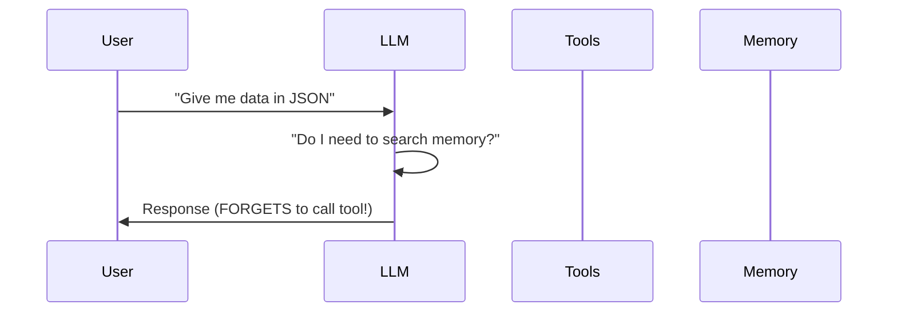
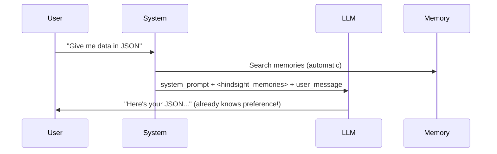

# Hindsight Memory System Analysis

## Context Injection vs Tool-Based RAG

The key innovation of Hindsight is **NOT** parallel retrieval with reranking - it's the **automatic context injection mechanism**.

### Traditional Tool-Based Approach



**Problem**: The LLM must **decide** to call the memory tool. If it doesn't recognize the query requires memory, it fails.

### Hindsight's Context Injection Approach



**Key insight**: Memories are **automatically injected** into the context - the LLM doesn't need to decide anything.

## The Critical Difference

| Aspect | Tool-Based RAG | Hindsight Injection |
|--------|---------------|---------------------|
| **Decision maker** | LLM decides to call tool | System automatically retrieves |
| **Reliability** | LLM may forget to recall | Memories always present if relevant |
| **Latency** | +1 LLM call (tool decision) | Direct retrieval, no LLM overhead |
| **Use case** | Explicit memory requests | Implicit preferences/context |

## Why This Matters

**User preference**: "Always return technical data as JSON"

### Tool-based approach fails:
```
User: "Show me server metrics"
LLM thinks: "This is a simple data request, no need for memory tools"
LLM responds: Plain text response ❌
```

### Hindsight injection succeeds:
```
User: "Show me server metrics"
System: [searches memories by vector similarity]
System: [injects: "User prefers JSON responses for technical data"]
LLM sees: <hindsight_memories>[preference: JSON]</hindsight_memories> + "Show me server metrics"
LLM responds: JSON response ✅
```

## Multi-Strategy Parallel Retrieval

While injection is the key innovation, Hindsight also uses sophisticated retrieval:

### 4-Way Parallel Retrieval

1. **Semantic** - Vector similarity search
2. **BM25** - Keyword/full-text search  
3. **Graph** - Entity/temporal/causal link traversal
4. **Temporal** - Date range filtering with spreading

### Result Fusion

```python
# Reciprocal Rank Fusion (RRF)
# score(d) = sum_over_lists(1 / (k + rank(d)))
# Documents appearing in multiple lists get boosted
```

Results are merged using RRF, then reranked with a cross-encoder.

## Biomimetic Memory Architecture

Hindsight organizes memories like human memory:

- **World facts** - General knowledge ("The sky is blue")
- **Experience facts** - Personal experiences ("I visited Paris")
- **Mental models** - Synthesized knowledge from reflection
- **Observations** - Consolidated patterns

## Implementation in .NET + Azure

### Context Injection Pattern

```csharp
public class ContextInjectionMiddleware
{
    private readonly IVectorSearchService _memory;
    
    public async Task<string> BuildPromptWithMemories(string userMessage)
    {
        // 1. Search memories by vector similarity (automatic!)
        var embedding = await _embeddings.GenerateAsync(userMessage);
        var memories = await _memory.SearchAsync(embedding, topK: 5);
        
        // 2. Inject into context
        var memoryBlock = memories.Any() 
            ? $"<hindsight_memories>\n{JsonSerializer.Serialize(memories)}\n</hindsight_memories>\n\n"
            : "";
            
        return $"{systemPrompt}\n{memoryBlock}User: {userMessage}";
    }
}
```

### Auto-Capture (Hooks) Pattern

For storing memories without explicit tool calls:

```csharp
public class MemoryCaptureHook
{
    public async Task OnResponseComplete(string userMessage, string assistantResponse)
    {
        // Use LLM to extract facts from conversation
        var facts = await _llm.ExtractFactsAsync($"""
            Extract key facts about user preferences from:
            User: {userMessage}
            Assistant: {assistantResponse}
            """);
            
        // Store in vector DB
        foreach (var fact in facts)
        {
            await _memory.StoreAsync(fact);
        }
    }
}
```

## Key Benefits

1. **Very high reliability** - Agent simply "cannot forget" to recall relevant memories
2. **Reduced LLM calls** - No tool decision latency, faster inference
3. **No tool calls needed** - LLM doesn't need to make explicit tool calls for memory
4. **Implicit context** - Works for preferences the user shouldn't have to repeat

## Use Cases

- User preferences (JSON vs text)
- Coding style preferences
- Implicit context that should "just be known"
- Any scenario where the LLM should remember without being asked

## Summary

The innovation is **reliable context injection** without requiring the LLM to make tool decisions. The parallel retrieval + reranking is just how Hindsight finds the *best* memories to inject - but the injection pattern itself is the game-changer.

---

*Analysis based on the Hindsight project: https://github.com/vectorize-io/hindsight*
